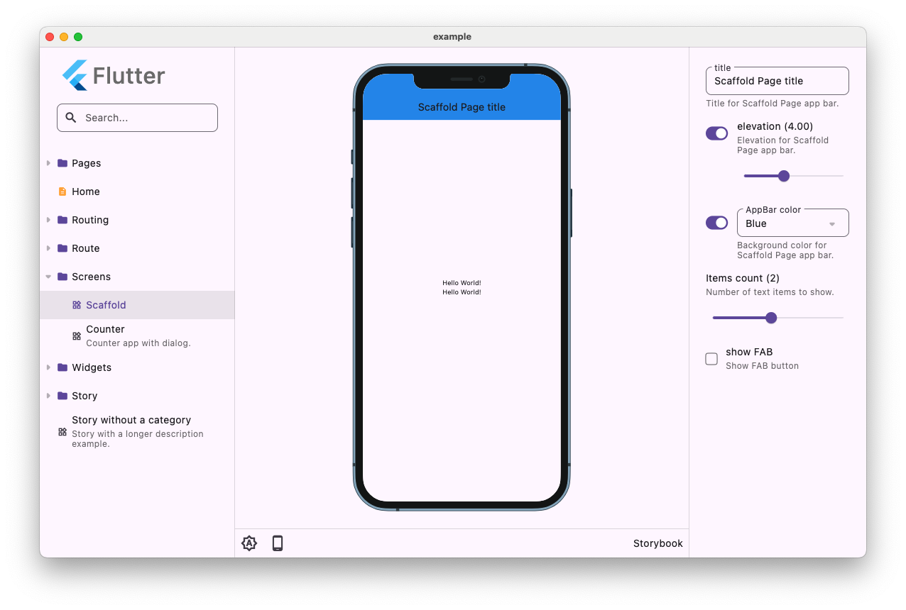

# Storybook Toolkit

Toolkit for showcase all your widgets. Work at all platforms supported by Flutter.



## Getting Started

```dart
class MyApp extends StatelessWidget {
  @override
  Widget build(BuildContext context) =>
      Storybook(
        stories: [
          Story(
            name: 'Screens/Counter',
            description: 'Demo Counter app with about dialog.',
            builder: (context) => CounterPage(
              title: context.knobs.text(label: 'Title', initial: 'Counter'),
              enabled: context.knobs.boolean(label: 'Enabled', initial: true),
            ),
          ),
          Story(
            name: 'Widgets/Text',
            description: 'Simple text widget.',
            builder: (context) => const Center(child: Text('Simple text')),
          ),
        ],
      );
}
```

## Features

- Showcase of all your components.
- Development your widgets, components and screens in isolated workspaces.
- Simulate frames of multiple devices with [device_frame_plus](https://pub.dev/packages/device_frame_plus) package.
- Update your custom variables with knobs.
- Change between multiple languages.
- Change text scales.
- Change auto, dark and light themes.
- Generate golden tests for your components.
- Possibility to add more features via plugins.

## Customization

By default, each story is wrapped into `MaterialApp`.

You can override this behavior by providing either `wrapperBuilder` to the
`Storybook`. You can either use one of the default ones
(`materialWrapper`/`cupertinoWrapper`) or provide a fully custom wrapper. In the
latest case, make sure to use the `child` widget that will contain the story.

## Plugins

Almost all the functionality is provided by plugins. Even contents and
knobs are plugins (although they are first-party plugins).

Here is list of all our plugins:

- ContentsPlugin
- DeviceFramePlugin
- KnobsPlugin
- ThemeModePlugin
- CodeViewPlugin
- TextSizerPlugin
- TimeDilationPlugin
- DirectionalityPlugin
- LocalizationPlugin

## Golden tests

Storybook support golden tests:

1. Import `storybook_toolkit_tester` package:

  ```yaml
  dev_dependencies:
    storybook_toolkit_tester: ^1.2.0 
  ```

2. Create test file, e.g. `storybook_test.dart`.

3. Add the following content there:

   ```dart
   void main() => testStorybook(
     storybook,
     devices: { Devices.ios.iPhoneSE, Devices.android.pixel4, Devices.ios.iPadAir4 },
     filterStories: (Story story) {
       final skipStories = [];
       return !skipStories.contains(story.name);
     },
   );

   final storybook = Storybook(
     stories: [
       Story(
         name: 'Button',
         builder: (context) => ElevatedButton(
           onPressed: () {},
           child: const Text('Button'),
         ),
       ),
       Story(
         name: 'CounterPage',
         builder: (context) => const CounterPage(),
       ),
     ],
   );
   ```

5. Generate golden images by running: `flutter test --update-goldens --tags=storybook`.

## Contributing

Pull requests are welcome. For major changes, please open an issue first to discuss what you would like to change.

## Special thanks

This project is fork of storybook_flutter. I want to thank previous developers for their work:

- [Kirill Bubochkin](https://github.com/ookami-kb): Creator and first maintainer of [storybook_flutter](https://github.com/ookami-kb/storybook_flutter)
- [Yolo Group](https://github.com/coingaming): Developers from Estonia for their improvements in [storybook_flutter](https://github.com/coingaming/storybook_flutter)

## Maintainer

👤 **Martin Jablečník**

* Website: [martin-jablecnik.cz](https://www.martin-jablecnik.cz)
* Github: [@mjablecnik](https://github.com/mjablecnik)
* Blog: [dev.to/mjablecnik](https://dev.to/mjablecnik)

## Show your support

Give a ⭐️ if this project helped you!

<a href="https://www.patreon.com/mjablecnik">
  
</a>

