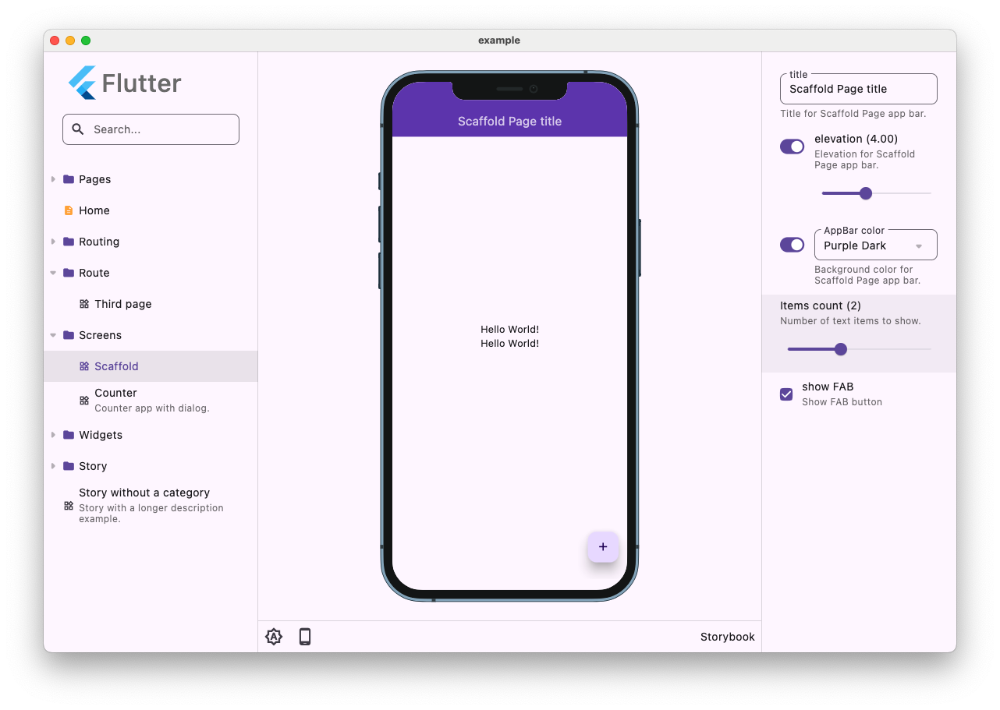

# Flutter Storybook

A cross-platform storybook for showcasing widgets. It should work at all platforms supported by Flutter.



## Getting Started

```dart
class MyApp extends StatelessWidget {
  @override
  Widget build(BuildContext context) =>
      Storybook(
        stories: [
          Story(
            name: 'Screens/Counter',
            description: 'Demo Counter app with about dialog.',
            builder: (context) => CounterPage(
              title: context.knobs.text(label: 'Title', initial: 'Counter'),
              enabled: context.knobs.boolean(label: 'Enabled', initial: true),
            ),
          ),
          Story(
            name: 'Widgets/Text',
            description: 'Simple text widget.',
            builder: (context) => const Center(child: Text('Simple text')),
          ),
        ],
      );
}
```


## Customization

By default, each story is wrapped into `MaterialApp`.

You can override this behavior by providing either `wrapperBuilder` to the
`Storybook`. You can either use one of the default ones
(`materialWrapper`/`cupertinoWrapper`) or provide a fully custom wrapper. In the
latest case, make sure to use the `child` widget that will contain the story.


## Plugins

Almost all the functionality is provided by plugins. Even contents and
knobs are plugins (although they are first-party plugins).

Plugins documentation is TBD, but you can take a look at the existing first-party plugins: 
- ContentsPlugin
- DeviceFramePlugin
- KnobsPlugin
- ThemeModePlugin
- CodeViewPlugin
- TimeDilationPlugin
- DirectionalityPlugin
 

## Golden tests

Storybook support golden tests:

1. Create test file, e.g. `storybook_test.dart`.

2. Add the following content there:

   ```dart
   void main() => testStorybook(
     storybook,
     devices: {Device.iPhone8, Device.iPhone13, Device.pixel5, Device.iPadPro},
     filterStories: (Story story) {
       final skipStories = [];
       return !skipStories.contains(story.name);
     },
   );

   final storybook = Storybook(
     stories: [
       Story(
         name: 'Button',
         builder: (context) => ElevatedButton(
           onPressed: () {},
           child: const Text('Button'),
         ),
       ),
       Story(
         name: 'CounterPage',
         builder: (context) => const CounterPage(),
       ),
     ],
   );
   ```

3. Generate golden images by running: `flutter test --update-goldens --tags=storybook`.


## Contributing
Pull requests are welcome. For major changes, please open an issue first to discuss what you would like to change.


## Maintainer

👤 **Martin Jablečník**

* Website: [martin-jablecnik.cz](https://www.martin-jablecnik.cz)
* Github: [@mjablecnik](https://github.com/mjablecnik)
* Blog: [dev.to/mjablecnik](https://dev.to/mjablecnik)


## Show your support

Give a ⭐️ if this project helped you!

<a href="https://www.patreon.com/mjablecnik">
  
</a>


## Special thanks

This project is fork of [https://github.com/coingaming/storybook_flutter](https://github.com/coingaming/storybook_flutter)
and it is fork of [https://github.com/ookami-kb/storybook_flutter](https://github.com/ookami-kb/storybook_flutter)

So I want to thank previous developers for their work:
- [Kirill Bubochkin](https://github.com/ookami-kb): Creator and first maintainer of [https://github.com/ookami-kb/storybook_flutter](https://github.com/ookami-kb/storybook_flutter)
- [Yolo Group](https://github.com/coingaming) Developers from Estonia for their improvements in [https://github.com/coingaming/storybook_flutter](https://github.com/coingaming/storybook_flutter)